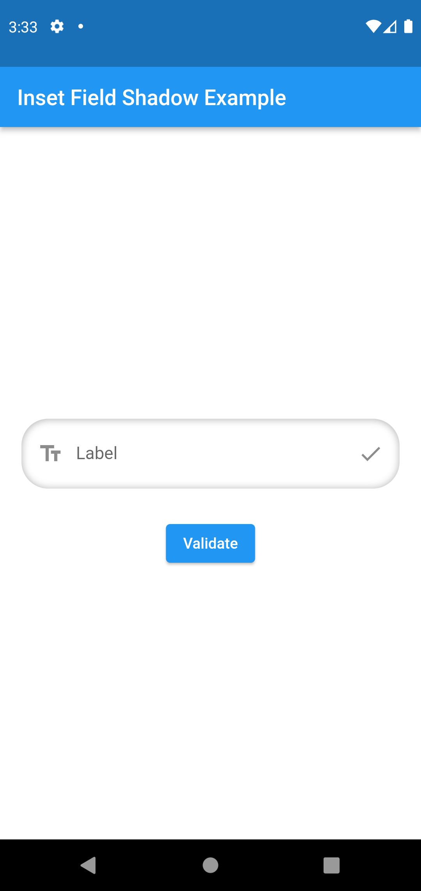
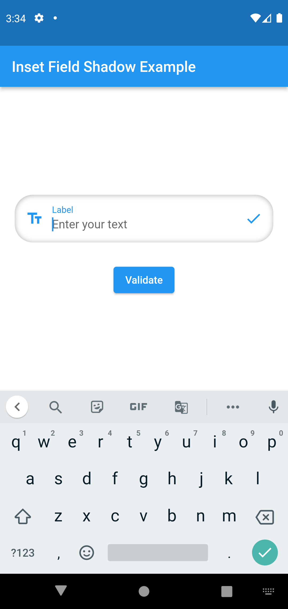
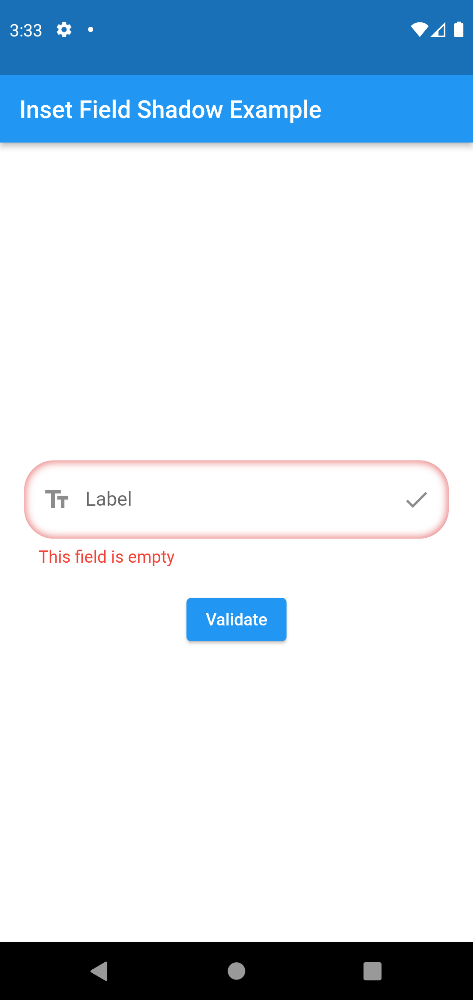

# InsetFieldShadow

A Flutter text field with a unique inset shadow effect and full support for TextFormField functionality. The InsetFieldShadow package allows you to create customizable text fields with inset shadows, enhancing the visual appeal of your input forms.


<p align="left">
  
  
  
</p>

## Features:

- Customizable inset shadow for a stylish and modern look.
- Full support for TextFormField functions, including validation.
- Options for prefix, suffix, labels, and hint text.
- Supports secure text input (for password fields).
- Expandable text fields with adjustable margins and paddings.
- Easy integration with existing Flutter forms.

## Installation:
Add the `inset_field_shadow` package to your project's `pubspec.yaml` file:

```yaml
dependencies:
  flutter:
    sdk: flutter
  inset_field_shadow: <latest-version>
```
Then, run the following command to fetch the package:

```bash
flutter pub get
```

## Usage:

Here’s an example of how to use the InsetFieldShadow widget in your Flutter project:

```dart
 InsetFieldShadow(
    margin: const EdgeInsets.all(12.0),
    padding: const EdgeInsets.all(3.0),
    controller: TextEditingController(),
    hint: 'Enter your text',
    validator: (value) {
      if (value!.isEmpty) {
        return "This field is empty";
      }
      return null;
    },
    label: const Text('Label'),
    prefix: const Icon(Icons.text_fields),
    suffix: const Icon(Icons.check),
  ),
```

## Customizable Options:

- `label`: Widget displayed inside the text field.
- `hint`: Placeholder text when the field is empty.
- `prefix`: Icon or widget displayed at the start of the text field.
- `suffix`: Icon or widget displayed at the end of the text field.
- `keyboardType`: Specify the type of keyboard (e.g., text, email, etc.).
- `controller`: Manage the text input programmatically.
- `obscureText`: Hide the text input (for passwords).
- `onTap`: Callback triggered when the text field is tapped.


## License:

This package is licensed under the MIT License. See the LICENSE file for more details.

